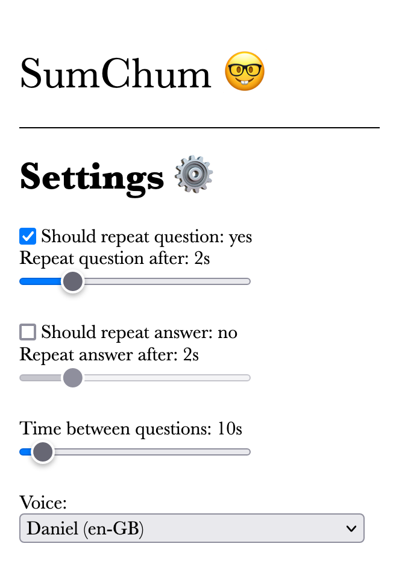

# SumChum 🤓

> [Try it out here!](https://projects.ollybritton.com/SumChum)

SumChum is a website that lets you practice mental arithmetic and other mental calculations, e.g. determining the day of the week corresponding to any given date. I mainly built it to use while running, so it works by using text-to-speech to read out questions, waiting a certain amount of time, and then saying the answer.

As you can see from the image above, it's quite bare-bones.

### The name

From "Genius At Play" by Siobhan Roberts, a biography of John Conway:

> ...“It was just like old times, as Annie remarked. She’d think to herself, “There goes somebody looking strange. Ergo, it must a friend of Dad’s!” — one of his “sum chums,” as his daughters called them. This strange somebody glanced at the group of us and kept going until he caught sight of Conway, whereupon he joined the gathering.”
